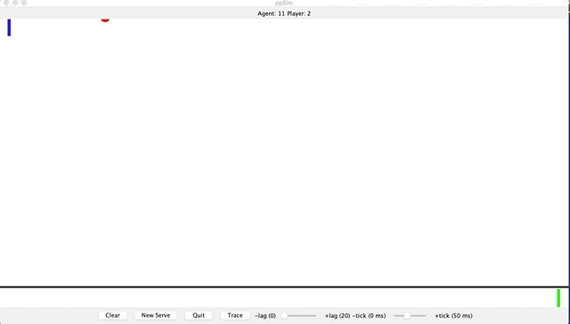

# PingPongJava
This is a Ping Pong game programmed using Java and Eclipse IDE in which a player and a computer agent simulate the game of ping pong. 

## Description:

In fact, the paddle on the right is controlled by the user's cursor while the one on the right is a computer. The trajectory of the ball could be shown using the toggle button "trace". The difficulty of the game can also be controlled using the sliders "lag" and "tick" which controls the computer's response time and the travel time of the ball, respectively. 

ACM graphics program was used to code this game, therefore, it should be downloaded and added in the "Add External JAR" section found through "Build Path" in Eclipse in order to run the code. The class that should be run is "ppSim".

The following is a GIF represeting a short gameplay of the program:

### Buttons:

- Clear: Restart the game and the score board
- New Serve: Restart the game without resetting the score board
- Quit: Quit the game
- Trace: Toggle button that lets the user choose whether they want the ball's trajectory or not
- Lag: Controls the computer's response time (higher response time means more lag, therefore, it's easier to win)
- Tick: Control the travel time of the ball (higher tick means the ball's movement is laggy, therefore, it's easier to win)

### References:
- This project was made for an Introduction to Software Development class (ECSE 202) at McGill, therefore, part of the code is taken from Prof. Frank Ferrie and the TA Katrina Poulin.

